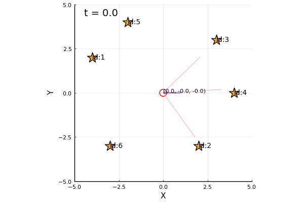
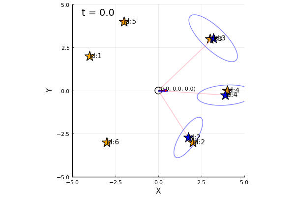
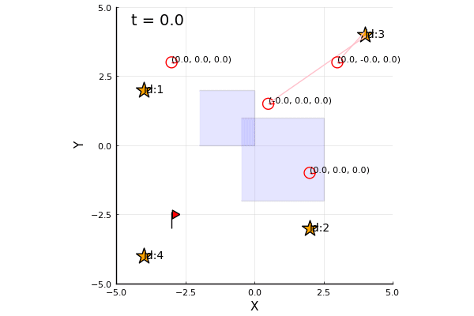

# JuliaAutonomy
[](https://travis-ci.org/ShisatoYano/JuliaAutonomy) [](https://ci.appveyor.com/project/ShisatoYano/juliaautonomy)  [](https://codecov.io/gh/ShisatoYano/JuliaAutonomy)  
Julia codes for Autonomy, Robotics and Self-Driving Algorithms.  
  

# Table of Contents
* [About this repository](#about-this-repository)  
* [How to use](#how-to-use)
* [Requirements](#requirements)  
* [Sample codes](#sample-codes)  
    * [Localization](#localization)  
        * [Particle Filter](#particle-filter)  
        * [Kalman Filter](#kalman-filter)
        * [Reset Process](#reset-process)
    * [SLAM](#slam)
    * [Decision Making](#decision-making)
* [License](#license)  
* [Contribution](#contribution)  
* [Author](#author)

# About this repository
This repository is a Julia sample codes collection of Autonomy, Robotics and Self-Driving Algorithms.  
I've been inspired by and referring to the following projects.  
* [LNPR](https://github.com/ryuichiueda/LNPR)  
* [PythonRobotics](https://github.com/AtsushiSakai/PythonRobotics)  

# How to use
1. Clone this repository.  
```git
git clone https://github.com/ShisatoYano/JuliaAutonomy.git
```

2. Install the required packages.  
```julia
julia> include("setup.jl")
julia> Setup.install_packages()
```

3. Execute Julia script in each directory.  
For example,  
```julia
julia> include("src/localization/particle_filter/random_sampling/anime_mcl_rand_samp.jl")
julia> AnimeMclRandSamp.main()
```

4. Add star to this repository, if you like it.  

# Requirements
* Julia 1.6.x  
* Plots  
* DataFrames  
* CSV  
* Test  
* StatsPlots
* Statistics
* FreqTables
* NamedArrays
* Distributions
* LinearAlgebra
* StatsBase
* PDMats
* Combinatorics

# Sample codes
## Localization
### Particle Filter
Monte Carlo Localization by Particle Filter  
considering Random Sampling  
  

KLD(Kullback-Leibler Divergance) Sampling  
  

### Kalman Filter
Localization by Extended Kalman Filter  
  

### Reset Process
Adaptive reset MCL for kidnapped robot problem  
  

Expansion + Sensor reset MCL for kidnapped robot problem  
  

## SLAM
FastSLAM 1.0  
  

FastSLAM 2.0  
  

Graph-based SLAM  
  

## Decision Making
Markov Decision Process  
 

Reinforcement Learning  
  

# License
MIT  

# Contribution
Any contribution is welcome.  

# Author
[Shisato Yano](https://github.com/ShisatoYano) ([@4310sy](https://twitter.com/4310sy))  