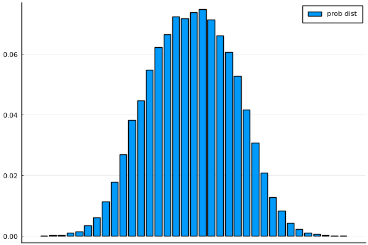
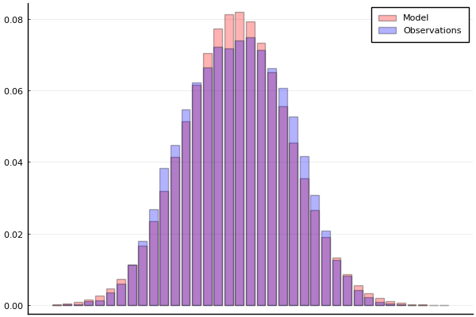
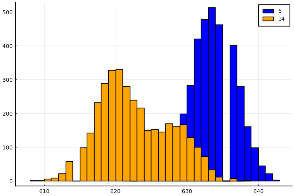
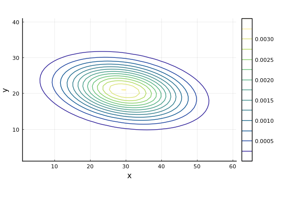

# JuliaAutonomy
[](https://travis-ci.org/ShisatoYano/JuliaAutonomy)   [](https://coveralls.io/github/ShisatoYano/JuliaAutonomy?branch=main)  
Julia codes for Autonomy, Robotics and Self-Driving Algorithms.  

# Table of Contents
* [About this repository](#about-this-repository)  
* [How to use](#how-to-use)
* [Requirements](#requirements)  
* [Julia scripts](#julia-scripts)
    * [Basics of Probability and Statistics](#basics-of-probability-and-statistics)  
        * [Sensor data collection](#sensor-data-collection)  
        * [Frequency/Probability distribution](#frequencyprobability-distribution)  
        * [Probabilistic Model](#probabilistic-model)  
        * [Complex Distribution](#complex-distribution)  
        * [Multidimensional Distribution](#multidimensional-distribution)  
* [License](#license)  
* [Contribution](#contribution)  
* [Author](#author)

# About this repository
This repository is a Julia sample codes collection of Autonomy, Robotics and Self-Driving Algorithms.  
I've been inspired by and referring to the following projects.  
* [LNPR](https://github.com/ryuichiueda/LNPR)  
* [PythonRobotics](https://github.com/AtsushiSakai/PythonRobotics)  

# How to use
1. Clone this repository.  
```git
git clone https://github.com/ShisatoYano/JuliaAutonomy.git
```

2. Install the required packages.  
```julia
julia> include("setup.jl")
julia> Setup.install_packages()
```

3. Execute Julia script in each directory.  
For example,  
```julia
julia> include("src/prob_stats/sensor_data/print_sensor_data.jl")
julia> PrintSensorData.main()
```

4. Add star to this repository, if you like it.  

# Requirements
* Julia 1.5.x  
* Plots  
* DataFrames  
* CSV  
* Test  
* StatsPlots
* Statistics
* FreqTables
* NamedArrays
* Distributions
* LinearAlgebra

# Julia scripts
## Basics of Probability and Statistics
### Sensor data collection
Sensor data with LiDAR  
  

### Frequency/Probability distribution
Frequency distribution  
  

Probability distribution  
  

### Probabilistic Model
Gaussian Distribution Model vs Observation  
  

### Complex Distribution
Frequency histogram grouped by hour  
  

Probability Heatmap  
  

### Multidimensional Distribution
Marginal KDE  
  

Contour of Probability  
  

# License
MIT  

# Contribution
Any contribution is welcome.  

# Author
[Shisato Yano](https://github.com/ShisatoYano) ([@4310sy](https://twitter.com/4310sy))  