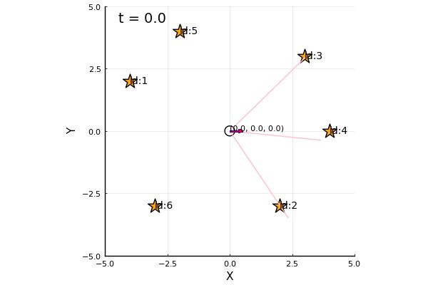

# Particle Filter

## Simulation examples
* Random Sampling  
src/localization/particle_filter/random_sampling/anime_mcl_rand_samp.jl  
  

* Systematic Sampling  
src/localization/particle_filter/systematic_sampling/anime_mcl_sys_samp.gif  
  

## Monte Carlo Localization
* Method to estimate self-pose by Particle Filter  
* Calculate distribution of particles with State transition/Observation model  
* Distribution of particles represent one of belief  

## Particle

### State transition
* Noise when robot is moving follows gaussian distribution  
* The variance is proportional to amount of movement  
* : Standard deviation of distance per 1[m] forward  
* : Standard deviation of distance per 1[rad] rotation  
* : Standard deviation of direction per 1[m] forward  
* : Standard deviation of direction per 1[rad] rotation  
* Drawing amount of noise from gaussian distribution with standard deviation b affects a:   
* Update amount of noise which is proportional to amount of movement/rotation  
  
* State transition model considering noise  
  

### How to adjust parameters of noise
* Calculate variance of pose by multiple robot's movement and rotation simulation  
1. : sqrt of value variance of direction is divided by mean of distance  
2. : sqrt of value variance of distance is divided by mean of distance  
3. : sqrt of value variance of direction is divided by mean of direction  
4. : sqrt of value variance of distance is divided by mean of direction  

### Approximation of belief distribution by particle
  

### How to reflect observation to particle
* Observation Model for Landmark :   
* With the above model, we can evaluate which is more plausible,  or ?  

  
* This model can be defined as the following Likelihood function  
  

### Weight of particle
* Particle is defined as a pair of pose and weight:   
* Sum of each particle's weight:   
* Update weight by reflecting observation:   

### Likelihood function  
* Observation  of landmark  at pose   
* Variation of  follows 2-dimensional gaussian distribution  
* Covariance matrix: , Observation function:   
, ![Q_j(\mathbf{x}) = \begin{pmatrix}
[l_j(\mathbf{x})\sigma_l]^2 & 0 \\
0 & \sigma_{\varphi}^2
\end{pmatrix}
](https://render.githubusercontent.com/render/math?math=%5Clarge+%5Cdisplaystyle+Q_j%28%5Cmathbf%7Bx%7D%29+%3D+%5Cbegin%7Bpmatrix%7D%0A%5Bl_j%28%5Cmathbf%7Bx%7D%29%5Csigma_l%5D%5E2+%26+0+%5C%5C%0A0+%26+%5Csigma_%7B%5Cvarphi%7D%5E2%0A%5Cend%7Bpmatrix%7D%0A)  
* Define Likelihood function: ![L_j(\mathbf{x}|\mathbf{z}_j) = N[\mathbf{z}=\mathbf{z}_j|\mathbf{h}_j(\mathbf{x}), Q_j(\mathbf{x})]](https://render.githubusercontent.com/render/math?math=%5Clarge+%5Cdisplaystyle+L_j%28%5Cmathbf%7Bx%7D%7C%5Cmathbf%7Bz%7D_j%29+%3D+N%5B%5Cmathbf%7Bz%7D%3D%5Cmathbf%7Bz%7D_j%7C%5Cmathbf%7Bh%7D_j%28%5Cmathbf%7Bx%7D%29%2C+Q_j%28%5Cmathbf%7Bx%7D%29%5D)  

## Resampling  
* Delete particles which weight is too small  
* Divide particles which weight is big  
* Sum of weight should be 1 by normalizing  
### Simple random sampling
* Old list of particles before resampling:   
* New list of particles after resampling:   
* Iterate the following processes for N' times(N' is number of new particles)  
1. Select a particle from old list randomly(proportional to weight)  
2. Copy selected particle  
3. The weight is changed as 1/N' and the particle is added to new list  
### Systematic sampling
* Binary search is used for the above random sampling  
* Computational complexity to select a particle is O(log n)  
* Should be reduced to O(N)  
* In addition, important to escape sampling bias  
* Systematic sampling can resolve these problems  

1. Create a list of weight by accumulating each particle's weight  
2. , W: sum of weights, N': number of selected particles  
3. Set pointer at where accumulated weight is r from head of list  
4. Iterate the following process for N times  
  4-1. Select an weight of pointer in list  
  4-2. Add the particle which has the weight to new list  
  4-3. Weight is changed as 1/N' for normalization  
  4-4. Plus W/N' to r
